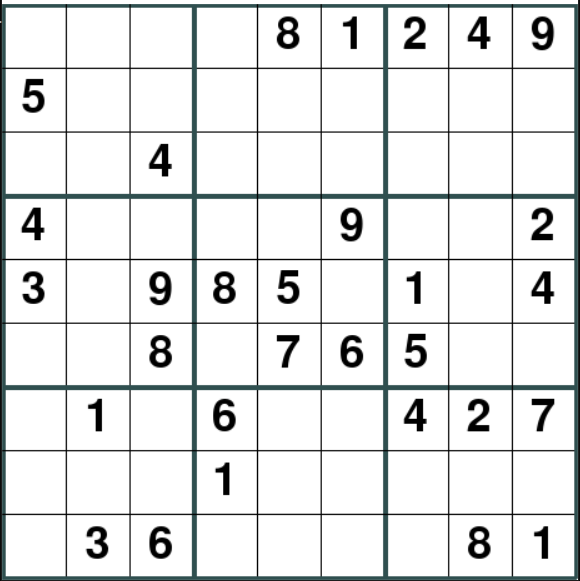
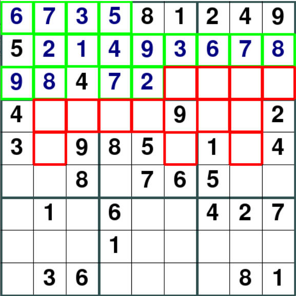
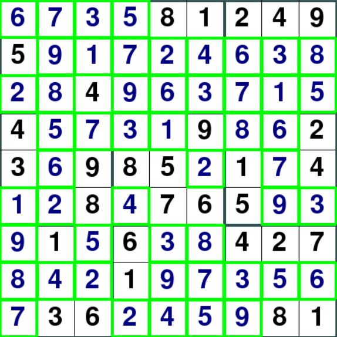

# ABOUT
The project is a logic-based game called Sudoku. On running the code, the GUI window displays a sudoku board randomly chosen from a set of already initialized boards. You can activate pencil-mode to enter the possible values in a cell or directly place a value you are sure about, and on submitting the board you get the result. The most important feature of the project is a *solver* that solves the board and comes up with a valid solution using the *Backtracking Algorithm*. It also contains an option for watching the visualisation of the entire process the algorithm goes through to solve the board.

&nbsp;&nbsp;&nbsp;&nbsp;&nbsp;&nbsp;&nbsp;&nbsp;&nbsp;&nbsp;&nbsp;&nbsp;&nbsp;&nbsp;&nbsp;&nbsp;&nbsp;&nbsp;&nbsp;&nbsp;&nbsp;&nbsp;&nbsp;&nbsp;

Backtracking Algorithm is very fundamental and powerful and is definitely a better option than the brute-force technique that tries every possible combination of values until it reaches a valid solution. **All the instructions and information related to the control keys will be printed on the terminal alongside the game.**

**Note that the numeric keypad won't be functional. Use the typewriter keys instead.**
